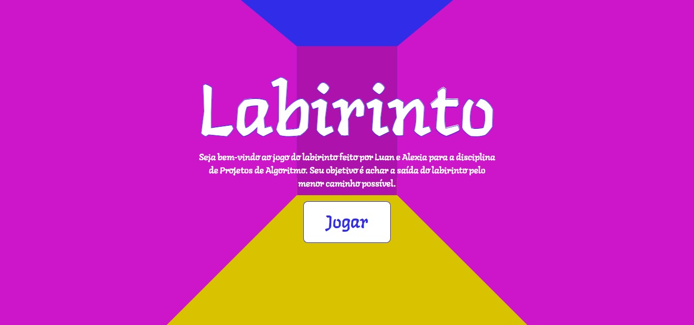

# LABIRINTO

Desenvolvido com React

Imagens meramente ilustrativas.

# Apresentação

<iframe width="560" height="315" src="https://www.youtube.com/embed/PtG6DuonR3o?si=qbqvIbIJEXUCRB1a" title="YouTube video player" frameborder="0" allow="accelerometer; autoplay; clipboard-write; encrypted-media; gyroscope; picture-in-picture; web-share" referrerpolicy="strict-origin-when-cross-origin" allowfullscreen></iframe>

## Inicializando

### `npm install` para baixar os pacotes necessário

### `npm start` para inicializar o labirinto no link [http://localhost:3000](http://localhost:3000)

> O primeiro acesso pode demorar alguns minutos
